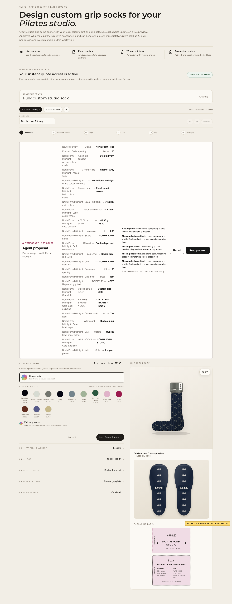

# CoDesign Commerce Item 10 — local KORRHAUS integration evidence

**Date:** 28 August 2026

**Release state:** local private-repository integration only

**Production state:** unchanged; no deployment, traffic change or feature enablement occurred

## Outcome

The real KORRHAUS Custom Sock Designer now has a narrow Manifest 2.0 adapter to
the same public CoDesign Commerce browser runtime used by the studio-tote
reference. This is an integration into the existing designer and renderer, not
a second sock designer.

The local integration registers exactly these six page-scoped WebMCP tools:

1. `codesign_read_workspace`
2. `codesign_list_capabilities`
3. `codesign_stage_asset`
4. `codesign_apply_proposal`
5. `codesign_get_previews`
6. `codesign_validate_proposal`

There is deliberately no WebMCP Keep, Revert, save, quote, price, application,
order, checkout, payment, proof, customer, supplier or administration tool.
Keep and Revert remain visible page-owned human controls.

## Existing-designer parity

The private versioned inventory `2026-08-27.1` accounts for the current Route
02 customer-editable product surface. Its Manifest 2.0 adapter exposes more
than 50 bounded controls spanning:

- collection and colourway names and quantities;
- product, stocked and exact body/accent colours, pattern and trim;
- studio-name typography or supplied artwork, finish, colour, scale and
  position;
- cuff construction, colour, label and label copy;
- grip plate, colour, motif, density, repeated text, centre window and text
  direction;
- standard or custom packaging, paper/ink colours, symbols and all editable
  label copy;
- duplicate, remove, reorder and activate operations for up to four
  colourways.

UI-only navigation/search/zoom, pre-production sample choice, commercial
actions and private data are explicitly excluded. The parity test fails if a
mapped control is missing, duplicated or not agent-writable.

## Transaction and visual behavior

- A proposal first waits for existing autosave/artwork work and reads a fresh
  secure baseline. It does not create a save merely by opening the designer.
- Proposal operations update the existing KORRHAUS renderer with persistence
  suppressed. Ordinary controls remain visible and are locked only while the
  temporary proposal is open.
- PNG, JPEG, WebP and SVG artwork up to the adapter limit is prepared through
  the existing KORRHAUS client pipeline but remains an opaque temporary asset.
  Upload/import occurs only after the shopper chooses page Keep.
- The preview tool captures the existing combined sock, grip and packaging
  proof as a bounded 640 by 640 WebP for every requested colourway. It is not a
  replacement renderer.
- Revert restores the committed baseline and performs zero local or server
  writes. Keep performs one local persist and the normal secure save;
  duplicate Keep is idempotent.
- An external change makes the proposal stale and blocks Keep. Invalid input,
  unavailable previews and uncertain save outcomes fail closed.
- Ordinary browsers without `document.modelContext` do not load CoDesign or
  show the review panel. Normal human drafts, autosave, logo uploads and
  notifications retain their existing path.

The actual-browser synthetic journey created two named 60-pair colourways from
a 120-pair brief, changed body/accent colour, knit, typography, cuff, grip and
packaging, and produced two distinct WebP artifacts. The visible proof changed
before Keep. Revert wrote nothing.

The screenshot contains synthetic North Form acceptance data and no customer
record, confidential price, margin, supplier value or credential.

## Build identity

| Artifact | SHA-256 |
| --- | --- |
| Public CoDesign browser runtime copied into the private app | `7a26da66b510b52acc4e358dd39cecabcf3fd474559adf055a2e507c6491ce27` |
| KORRHAUS Manifest 2.0 adapter source | `75bcbd8ddcac9c96583f4565c258eaf571540c78793a3718a72006839714a3c4` |
| KORRHAUS Manifest 2.0 adapter browser asset | `37edd74c2145f99241cb4480dfc23a929ac8104be070bb70590b7679ec09bb1c` |
| Integrated designer source | `8a0d0a5d2b4aa6d00223edd9f40a699142dd607d16c10b78d716878d7ac97b4a` |
| Integrated designer browser asset | `7213eb3257c3dda8e875b13211a1f47f14f0572b50dd1980b2591f6e49a90eb3` |

The private page asset version is `20260827-16`. The public runtime digest is
identical to the Item 9 browser bundle digest. The private app continues to
require `CUSTOM_SOCK_WEBMCP_PROPOSALS_ENABLED=true`; false remains the default.

## Verification

| Check | Result |
| --- | --- |
| ESLint on every changed integration/test file | PASS |
| Full ESLint | One pre-existing unrelated `no-explicit-any` failure in `app/about-you/about-you.test.ts:76`; no CoDesign lint failure |
| Vitest | PASS — 43 files / 220 tests |
| TypeScript | PASS |
| Production build | PASS |
| CoDesign V2 Playwright | PASS — 8 tests; 4 intentional project/device skips |
| Localization regression | PASS — 6 tests |
| Complete active Playwright suite | PASS — 107 tests; 5 intentional device skips |
| Targeted visual evidence repeat | PASS — 1 desktop test |

The active suite covers exact-six discovery, sanitized control inventory,
complete two-colourway rendering, distinct preview artifacts, temporary SVG
artwork, Keep once, zero-write Revert, invalid/stale safety, non-agent behavior,
mobile overflow, existing human autosave and localization. The retired
Manifest 1.0 five-tool block is explicitly excluded; its exact-six replacement
suite is the active contract.

## Public/private boundary and remaining gate

The reusable runtime, manifest/operation/proposal contracts, six tools and tote
reference remain in this public repository. KORRHAUS product mappings, private
identifiers, save routes and operational logic remain in the private app.
Nothing private was copied here other than this public-safe synthetic evidence
screenshot and the artifact hashes above.

Item 10 is locally complete. A KORRHAUS deployment is **not** authorized by
this evidence. Item 11 must prepare an immutable release candidate, then stop
for separate approval before any zero-traffic deployment and again before any
production traffic or feature enablement.
