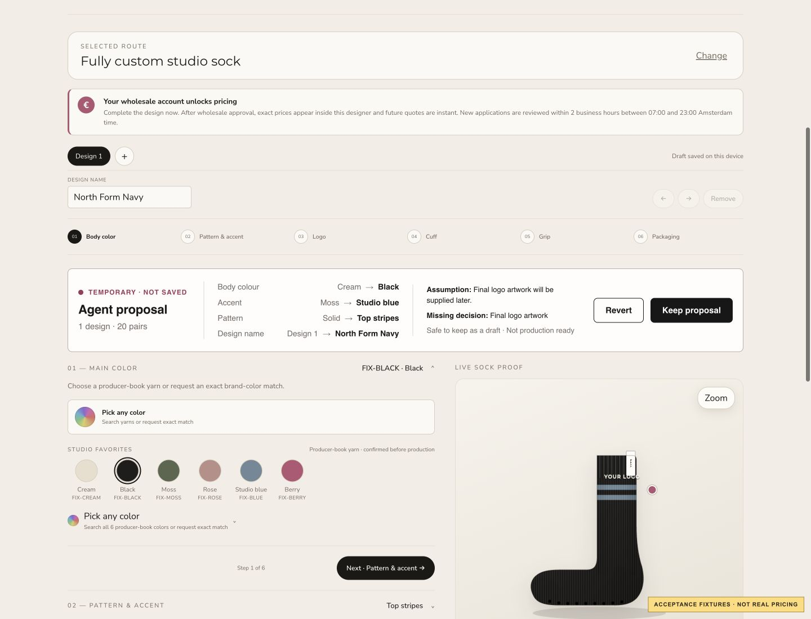

# KORRHAUS local bridge evidence

> **HISTORICAL TWO-TOOL BUILD.** The counts, hashes, and browser result below
> predate the complete five-tool integration and the later guarded private
> candidate. Use `KORRHAUS_GUARDED_LOCAL_CANDIDATE.md` for current local
> evidence; do not use this file to justify deployment or traffic promotion.

Date: 26 August 2026  
Public core source: `a79cdbb` (`fix: reveal review only after proposal succeeds`)  
Public browser bundle: `sha256:78ece1955a7416878c50a7f01325c702aa609974fb0cf816b1be3048e7f9819a`

## Scope and release state

The reusable CoDesign Commerce proposal engine was integrated into the existing private KORRHAUS Custom Sock Designer and verified locally. The integration is disabled unless `CUSTOM_SOCK_WEBMCP_PROPOSALS_ENABLED` is exactly `true`.

This evidence does **not** mean the bridge is deployed, publicly reachable, enabled in production, or approved for production traffic. No deployment, publication, DNS, or traffic action occurred.

The private application consumes the pinned public browser bundle. Its adapter remains inside the private designer closure and maps only the public canonical fields documented in `../KORRHAUS_BRIDGE_MAPPING.md`.

## Public boundary observed in the page

The local page registered exactly these WebMCP tools for the completed Phase 3 slice:

- `codesign_read_configuration`
- `codesign_propose_configuration`

The read result contained only:

- Configurator and manifest identifiers.
- Public revision and active design ID.
- Public design IDs, names, quantities, selections, and artwork readiness status.
- Total quantity and public cloning capabilities.
- Pending-proposal metadata when applicable.

No price, quote, customer, access, supplier, margin, raw boot configuration, project API, credential, token, artwork content, or private object path appeared in the discovered schemas or returned state.

## Actual WebMCP-capable browser run

The approved local acceptance preview was opened in the Codex in-app browser. The browser independently discovered the two tools from the private KORRHAUS page origin.

After the person entered Route 02, `codesign_read_configuration` returned the existing visible baseline. `codesign_propose_configuration` then staged one atomic proposal:

| Field | Before | Temporary proposal |
|---|---|---|
| Body colour | Cream | Black |
| Accent | Moss | Studio blue |
| Pattern | Solid | Top stripes |
| Design name | Design 1 | North Form Navy |

Observed result:

- `ok: true`.
- `persisted: false`.
- `configurationValid: true`.
- `productionReady: false`.
- Final logo artwork reported as `decision-required`.
- The same existing KORRHAUS sock preview changed visibly.
- The review panel appeared only after the proposal succeeded.
- Mutation, upload, route, and navigation controls were disabled while the proposal awaited review.
- The page clearly said `Temporary · Not saved` and offered only `Revert` and `Keep proposal` for the transaction.

Selecting Revert in that browser restored the exact public baseline revision and design values, removed the review panel, and left no pending proposal.

Screenshot: 1440 × 1100, `sha256:387f02c5d3808eb4364de96a8679704982335622ce3f7f69a453f1827276f1f1`. The yellow fixture label is intentionally visible so this local evidence cannot be mistaken for a real price or live production state.

## Persistence and regression evidence

The private Playwright suite instruments both local persistence and project requests.

| Scenario | Local writes | Server writes | Commit calls | Result |
|---|---:|---:|---:|---|
| Stage proposal | 0 | 0 | 0 | Temporary preview only |
| Revert | 0 | 0 | 0 | Exact baseline restored |
| Keep | 1 | 1 | 1 | Existing normal save path used once |

Additional bridge coverage proves:

- Staging waits for an in-flight normal autosave before taking its baseline.
- Normal human autosave and artwork upload still work with the feature flag both off and on.
- Private fields and stale design IDs are rejected.
- A server-applied external change invalidates an open proposal rather than allowing a stale Keep.
- A retry after Keep reuses the same idempotency boundary.

Final local verification outcomes:

| Check | Outcome |
|---|---|
| Private TypeScript typecheck | PASS |
| Private production build | PASS |
| Focused page/unit tests | PASS — 19 tests |
| Focused bridge E2E after final acceptance-fixture adjustment | PASS — 10 desktop/mobile tests |
| Complete private Designer E2E after final adjustment | PASS — 93 passed, 1 intentionally skipped |
| Actual WebMCP discovery, read, proposal, and Revert | PASS |

Expected 404 logs for deliberately unimplemented acceptance-fixture routes occurred in the full E2E run; the tests explicitly stub the relevant requests and completed successfully.

## Final local private hashes

These hashes identify the inspected local bridge state in the private repository, whose relevant files are currently untracked. They are evidence, not a public-source substitute.

| File | SHA-256 |
|---|---|
| `public/custom-socks/codesign-commerce.js` | `78ece1955a7416878c50a7f01325c702aa609974fb0cf816b1be3048e7f9819a` |
| `public/custom-socks/codesign-commerce.js.map` | `f9a6299c37573460cf3ba7811f1d6963173fcc8fd0c0bd9637d7cc47f5d564ad` |
| `public/custom-socks/designer-claude.js` | `0e9f5bbf52578a05b09112bb58ca9137224f88f69d8682fb641dae93487fec6a` |
| `public/custom-socks/designer-claude.min.js` | `558bf4e098eb73de7648bd86519d1999e1a2791ae02cae693a9d41f42f83c789` |
| `public/custom-socks/designer-claude.css` | `5acf01a12ed30907bf1698e63d2c0a857d5aea4fe91ca7ac3cb7a6c7355010b8` |
| `public/custom-socks/designer-claude.min.css` | `b1bdf864db192a5381370ddeec6fe3c70b5e82b5f09713371dfce62a8f207ffd` |
| `app/custom-socks/designer-page.server.ts` | `b0e1de02d6a625df2857306d4dd2863619d018f5e7dfdf4480c9df4070deb26d` |
| `app/custom-socks/designer-page.test.ts` | `eb88ba55a907669a434daa114a32542e8b8757ee8ff781dc40b417a5f2bf03d6` |
| `tests/e2e/custom-sock-designer.spec.ts` | `083282b5bb381073103c25da8cf36ae83477bb2b4b10eddc27251b2a2ff018df` |

The pre-migration spike hashes remain recorded in `../KORRHAUS_BRIDGE_MAPPING.md` so the challenge work can be distinguished from the private post-start baseline.

## Phase boundary

This historical evidence closes the Phase 3 two-tool local KORRHAUS safety
gate. The later complete five-tool North Form upgrade is independently recorded
in `KORRHAUS_LOCAL_FIVE_TOOL.md`. Neither local result closes the gates for a
no-traffic deployment, public hosting, production activation, or live
verification.
