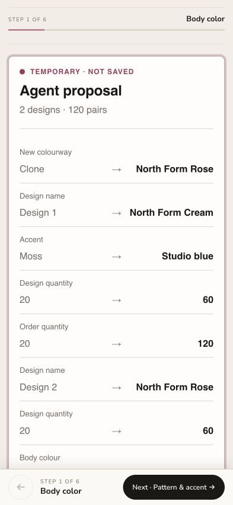

# KORRHAUS local five-tool flagship evidence

Date: 26 August 2026  
Public core source: `ea54e71` (`feat: complete five-tool configuration workflow`)  
Public evidence state: `37682a2` (`docs: record five-tool North Form evidence`)  
Public browser bundle: `sha256:3723b4937086323c1536406f2072efbd54da702ec63d7c2f94d32ea768f101f6`

## Scope and release state

The complete reusable CoDesign Commerce bundle was integrated into the local
private KORRHAUS Custom Sock Designer behind the existing disabled-by-default
`CUSTOM_SOCK_WEBMCP_PROPOSALS_ENABLED` feature flag.

No deployment, publication, public repository creation, production enablement,
traffic promotion, DNS change, quote action, upload, order, checkout, or
customer-data action occurred. This is local acceptance evidence only.

## Exact page-defined tool surface

The WebMCP-capable in-app browser independently discovered exactly:

1. `codesign_read_configuration`
2. `codesign_list_options`
3. `codesign_propose_configuration`
4. `codesign_create_design`
5. `codesign_validate_configuration`

There was no WebMCP tool for Keep, Revert, save, upload, quote, proof acceptance,
cart, checkout, order, payment, customer access, or administrative work.

The option read returned only public yarn, pattern, quantity, grip, and artwork
status contracts. It did not expose prices, commercial terms, margins,
customers, suppliers, tokens, private project data, raw boot configuration, or
internal endpoints.

## Actual-browser North Form flow

The local acceptance route was started fresh so its synthetic baseline was
confirmed before proposal staging. This mirrors the documented judge reset and
avoids treating an unconfirmed browser-local draft as safe to stage against.

The committed baseline was:

- One design named `Design 1`.
- 20 pairs total.
- Cream body, Moss accent, Solid pattern.
- Standard KORRHAUS grip.
- Revision `korrhaus-c8e8f23f`.

Before the agent proposal succeeded:

- The review panel was not visible.
- Keep was not visible.
- Revert was not visible.

The browser performed the exact five-tool sequence:

1. Read the current revision and design ID.
2. List the eight relevant public options and both public dependency rules.
3. Propose `North Form Cream` with Cream body and Studio blue accent.
4. Create `North Form Rose`, allocate 60 pairs to each design, set the order
   total to 120, and apply Rose/Berry to the second colourway.
5. Validate the open proposal.

Observed result:

- `ok: true`.
- `persisted: false`.
- Proposal revision `2`.
- Two visible design tabs: `North Form Cream` and `North Form Rose`.
- Two designs and 120 pairs shown in the existing review surface.
- `configurationValid: true`.
- `productionReady: false`.
- `FINAL_LOGO_ARTWORK_REQUIRED` reported for both design IDs as a
  `decision-required` issue.
- Assumptions preserved the even split, standard grip, and owner-supplied final
  logo boundary.
- The page said `Temporary proposal not saved` and visibly offered only human
  Keep/Revert controls for the transaction.

A read while the proposal was awaiting human review still returned the
committed one-design, 20-pair state and the original revision. Pending metadata
reported `persisted: false` and `status: awaiting-human`.

Selecting Revert in the same browser:

- Removed the `North Form Rose` tab.
- Cleared `pendingProposal`.
- Returned the same committed revision `korrhaus-c8e8f23f`.
- Restored the original one-design, 20-pair state.
- Reported `Agent proposal reverted · saved design unchanged`.

Screenshot: 393 × 852,
`sha256:5ef6881622b8e2f100b0771d5abf1b9f8a9ec65b73e613183c0d48dffcb3bdbd`.
The acceptance-fixture context is local and must not be represented as a live
production page.

## Safe failure and recovery observation

The first browser attempt used a previously reopened local draft whose
synthetic server baseline had not been confirmed in that page lifetime. The
proposal failed closed with retryable `ADAPTER_FAILURE`; no proposal preview or
persistence occurred. Starting a fresh Route 02 design confirmed the synthetic
baseline and the complete flow then passed.

This is useful recovery evidence: the integration refuses to stage against an
unconfirmed baseline instead of guessing. Judge instructions must start from
the explicit reset/fresh-design action.

## Automated persistence and regression evidence

The new five-tool E2E runs on desktop and mobile. Across a Revert pass followed
by a Keep pass it asserted:

| Boundary | Result |
|---|---|
| Proposal and design-draft creation before review | Zero local and server writes |
| Revert | Exact baseline restored; zero local and server writes |
| Keep | One local write, one server write, one commit call |
| Agent design-draft creation | Two calls total: one for Revert pass, one for Keep pass |
| Saved Keep state | Exactly `North Form Cream` 60 and `North Form Rose` 60 |

Final local verification:

| Check | Outcome |
|---|---|
| Private JavaScript syntax through asset build | PASS |
| Private TypeScript typecheck | PASS |
| Private production build | PASS |
| Focused page/unit tests | PASS — 12 tests |
| Focused five-tool E2E | PASS — desktop and mobile |
| Complete private Designer E2E | PASS — 95 passed, 1 intentionally skipped |
| Actual in-app-browser five-tool discovery and Revert | PASS |

Expected 404 logs for deliberately unimplemented acceptance-fixture routes
appeared in the complete E2E run. Those requests are explicitly stubbed by the
tests and did not fail the suite.

## Final inspected local private hashes

The relevant private files remain private and currently untracked. These hashes
identify the inspected local state; they are not public-source substitutes.

| File | SHA-256 |
|---|---|
| `public/custom-socks/codesign-commerce.js` | `3723b4937086323c1536406f2072efbd54da702ec63d7c2f94d32ea768f101f6` |
| `public/custom-socks/codesign-commerce.js.map` | `429c29dd5079673577809efd5f08a0676e02517f926a6f31c0114eaf086e076a` |
| `public/custom-socks/designer-claude.js` | `c02c34b25e6cf8efde5485e2a9c000824915d988b28fb40618fc2b12b663f103` |
| `public/custom-socks/designer-claude.min.js` | `02fe74ec7b12711a0403244e09019180e21ab39222bfc65f7aa4f067233ec6b2` |
| `public/custom-socks/designer-claude.css` | `5acf01a12ed30907bf1698e63d2c0a857d5aea4fe91ca7ac3cb7a6c7355010b8` |
| `public/custom-socks/designer-claude.min.css` | `b1bdf864db192a5381370ddeec6fe3c70b5e82b5f09713371dfce62a8f207ffd` |
| `app/custom-socks/designer-page.server.ts` | `c0382d8cd39ee7c843497fcc48e240ec5212dcfe081906298771ae814cadc92b` |
| `app/custom-socks/designer-page.test.ts` | `f5d21eb4d0784450058d7c7ced833fb30215db65eff21c6ae486600bfef2f400` |
| `tests/e2e/custom-sock-designer.spec.ts` | `6aec012cab0c7c4eac8c588ce7872518c5fdac70f6fe50523413280407ea2df2` |

## Phase boundary

This closes the complete local five-tool flagship milestone. It does not prove
hosted CI, public deployment, a no-traffic KORRHAUS revision, production
activation, live production verification, or challenge submission.

## Final security-remediation refresh

After the repository-wide security review, public remediation commit
`2f7235b` was rebuilt and pinned locally as
`codesign-commerce.js?v=dc8d6180`. The public and private browser bundles are
byte-identical at
`sha256:dc8d6180ba6bcdd426d735abe7dc73a8854559b05950b91936f57ee10d33ee1b`;
their source maps are byte-identical at
`sha256:05a189e528bf4c80067c53d8e45543cac5ddfe0f373c50dea5b6a9a02314e08f`.

The refreshed private checks passed:

| Gate | Result |
|---|---|
| Focused page/unit suite | PASS — 13 tests |
| Private TypeScript typecheck | PASS |
| Private production build | PASS |
| Actual in-app-browser tool discovery | PASS — exactly five tools |
| Review hidden before successful proposal | PASS |
| Visible proposal and `persisted: false` | PASS |
| Conflicting operation-ID payload | PASS — `OPERATION_ID_CONFLICT`, no second preview |
| Human Revert | PASS — exact `korrhaus-e7beb274` baseline restored |
| Browser errors/warnings | PASS — none |

Current local private hashes after this refresh:

| File | SHA-256 |
|---|---|
| `public/custom-socks/codesign-commerce.js` | `dc8d6180ba6bcdd426d735abe7dc73a8854559b05950b91936f57ee10d33ee1b` |
| `public/custom-socks/codesign-commerce.js.map` | `05a189e528bf4c80067c53d8e45543cac5ddfe0f373c50dea5b6a9a02314e08f` |
| `public/custom-socks/designer-claude.js` | `26df7140050b5e8dd53aaf486b62fb05eaeebf33024fc004a56eb84036c03e97` |
| `public/custom-socks/designer-claude.min.js` | `ae3c04df76402ab603eb1981f2de16bc933fc2274b6bca3de5ddc666b083e8c9` |
| `app/custom-socks/designer-page.server.ts` | `8f17e9b0dbb454e15a0c1a11f835893f6ec2734cd02fbf422147e2493f5264e7` |
| `app/custom-socks/designer-page.test.ts` | `bb26ef87b358936e0b404794cf03f92109fc0de27aa238f30e11d12bfe93b2c9` |

The full private Designer E2E result recorded above belongs to the earlier
five-tool bundle. The final remediation bundle has focused private tests,
typecheck, build, and actual-browser coverage here; the complete private E2E
suite must be rerun before final Phase 6 closure.
