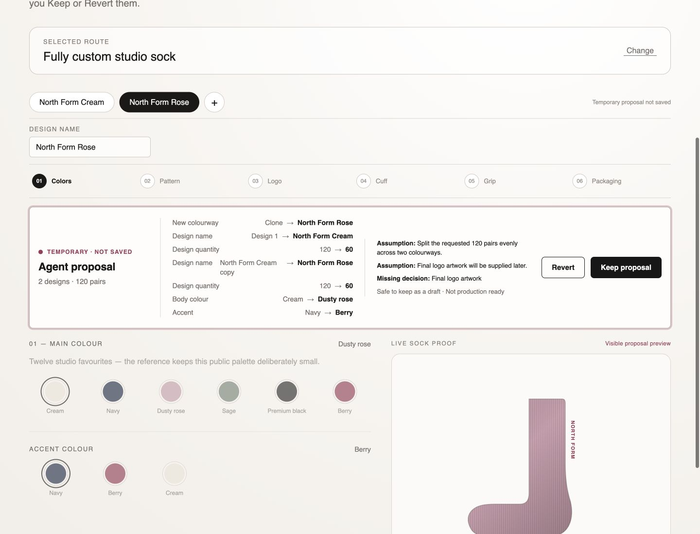
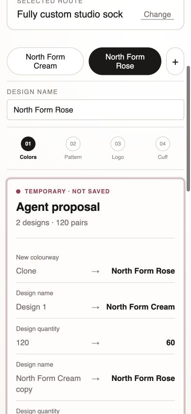

# North Form five-tool browser evidence

Date: 26 August 2026  
Source commit: `ea54e71` (`feat: complete five-tool configuration workflow`)  
Browser bundle: `sha256:3723b4937086323c1536406f2072efbd54da702ec63d7c2f94d32ea768f101f6`

## Actual webpage tool discovery

The public KORRHAUS reference was loaded normally in the Codex in-app browser. Its WebMCP capability independently reported exactly:

1. `codesign_read_configuration`
2. `codesign_list_options`
3. `codesign_propose_configuration`
4. `codesign_create_design`
5. `codesign_validate_configuration`

Read, list, and validate were annotated read-only. Propose and create-design were not. All five outputs were marked as potentially untrusted because public merchant/customer text can appear in results.

No Keep, Revert, save, upload, quote, application, checkout, order, payment, cart, Shopify-product, pricing, customer, margin, supplier, or administrative tool was registered.

## Exact browser call sequence

The run began from one committed 120-pair design at `reference-revision-1`.

1. `codesign_read_configuration` returned the one-design public baseline and cloning capability.
2. `codesign_list_options` requested only body colour, accent colour, grip, design name, per-design quantity, total quantity, and artwork status. It returned seven bounded public options and the two public dependency descriptions.
3. `codesign_propose_configuration` named the first design `North Form Cream` and recorded the even-split and later-artwork assumptions. It returned proposal revision 1 and `persisted: false`.
4. `codesign_create_design` extended that same proposal at revision 1. It cloned design 1, changed the original quantity from 120 to 60, named the clone `North Form Rose`, assigned it 60 pairs, changed its body to dusty rose and accent to berry, and left the inherited standard grip unchanged. It returned proposal revision 2 and one created design.
5. `codesign_validate_configuration` validated proposal revision 2.

Final tool result:

- Two designs.
- 60 pairs per design.
- 120 pairs total.
- Cream/navy first colourway.
- Dusty-rose/berry second colourway.
- Standard grip on both designs.
- `configurationValid: true`.
- `productionReady: false`.
- Final logo artwork reported as `decision-required` for both designs.
- Both assumptions retained across the proposal extension.
- `persisted: false`.
- Explicit human confirmation requirement with Keep/Revert choices.

The page showed two named tabs, selected the newly created second colourway, updated the same sock proof to dusty rose/berry, disabled mutation controls, changed its save line to `Temporary proposal not saved`, and rendered the created colourway plus all coordinated changes in the review surface.

## Revert proof

After a fresh full five-tool proposal, the visible Revert button was selected. A subsequent webpage read returned:

- One design named `Design 1`.
- Quantity 120 and total 120.
- Original `reference-revision-1`.
- No pending proposal.
- No visible proposal review.

The deterministic adapter tests separately prove zero local writes and zero server writes on this path. The browser run proves the actual UI and WebMCP lifecycle restored the baseline; it does not replace the deterministic counters.

## Visual evidence

Desktop: 1440 × 1100, `sha256:f38952d06644a223c16ab3d3a3dfad8142665e669cc01669c6e864fb4e0edae9`.

Mobile: 393 × 852, `sha256:9db9360f58e797086f1b7c5b07ec7c40c2cd7de37e61e6fddc657ab376eab985`.

The first mobile inspection found that a long cloned name was compressed into an unreadable column. The review rows were changed to a two-line label/value grid at narrow widths, the core bundle was rebuilt, and the corrected 393 × 852 state above was inspected again. No unresolved P0, P1, or P2 visual issue remained in the captured region.

## Deterministic result at the source commit

| Check | Outcome |
|---|---|
| Core/reference tests | PASS — 6 files, 54 tests |
| Strict typecheck | PASS |
| Core and reference production builds | PASS |
| Public-boundary check | PASS — 68 public candidates before committing these screenshots |
| Documentation-link check | PASS — 22 Markdown files before this evidence file |
| Eval-corpus structural check | PASS — 20 cases across 6 categories |
| Browser-bundle verification | PASS — digest `3723b493…f101f6` |

This closes the public five-tool and public-reference behavior, but not the private flagship five-tool upgrade, studio-tote portability proof, hosted CI, public deployment, production activation, or agent-selection evaluation gates.

## Anonymous judge reset and prompt alignment

Commit `b3a7634` adds the canonical `?reset=true` judge URL and the exact
two-example walkthrough in `docs/JUDGE_GUIDE.md`. The KORRHAUS reference keeps
no state between page loads; a fresh or reset URL begins at the same one-design,
120-pair `reference-revision-1` fixture. The development-only visual proposal
was also corrected to match the scored cream/navy and dusty-rose/berry brief.

The actual WebMCP-capable in-app browser then opened
`http://127.0.0.1:4174/?reset=true` and independently reported:

- One visible `Design 1` tab and 120-pair cream/navy baseline.
- No proposal review, Keep, or Revert control before an agent proposal.
- Exactly the same five intended CoDesign tools.
- No persistence, ordering, quote, upload, pricing, customer, or private-data
  tool.

At commit `b3a7634`, 62 tests, strict typecheck, both example builds, browser
bundle verification, the public-boundary scan over 89 candidates, documentation
links over 28 Markdown files, and all 24 eval-corpus entries passed. The public
reference Phase 5 milestone is therefore locally reproducible and complete.
Hosted CI, a public remote, and deployment remain separate gates.
